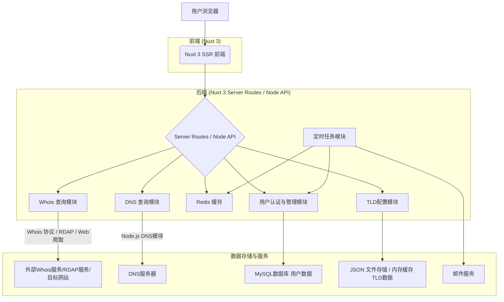

## 需求详情

根据 `README.md`，本项目旨在开发一个高性能、可扩展、支持国际化与增强功能的域名查询平台。核心功能包括 Whois 查询、DNS 查询、域名可用性检查，并支持批量查询、用户系统、历史记录、TLD 管理等。

## 需求目的

> 介绍需求背景，让大家了解相关上下文信息。

开发一个功能完善的域名信息查询平台，满足用户对域名信息的全面查询需求，并提供良好的用户体验和扩展性。

## 需求涉及历史业务逻辑

> 如果需要

无，全新项目。

## 技术方案

### 业务逻辑

#### 主要逻辑描述：

系统核心围绕域名信息的查询与展示展开，包括以下主要业务流程：

1.  **用户查询域名信息：**
    *   用户在前端输入域名。
    *   前端将请求发送至后端 API (`/api/whois/{domain}`, `/api/dns/{domain}`, `/api/available/{domain}`).
    *   后端首先检查 Redis 缓存，若命中则直接返回缓存数据。
    *   若未命中缓存，后端根据 TLD 配置，选择合适的查询器（Whois 协议、RDAP、Web 爬取）和解析器进行查询。
    *   后端将查询结果存入 Redis 缓存并返回给前端。
    *   前端对返回的原始数据进行格式化展示，支持原始数据和格式化数据切换。
    *   支持对 Whois 信息中的日期进行时区转换。
    *   显示域名标签（如注册10年、即将过期等）。
    *   显示域名溢价、注册续费价格和注册状态。

2.  **批量域名查询：**
    *   用户在批量查询页面输入多个域名。
    *   前端通过 EventSource 与后端建立长连接，分批发送查询请求。
    *   后端实时处理查询请求，并将结果通过 EventSource 推送给前端。
    *   前端实时展示查询进度和结果。

3.  **用户系统：**
    *   用户可以注册、登录、找回密码。
    *   登录后，用户的查询历史、偏好设置将被保存到数据库。
    *   支持用户收藏域名，加入观察清单。

4.  **TLD 管理 (管理员)：**
    *   超级管理员可以增删改查 TLD 信息，包括 Whois 服务器、关键词模式等。
    *   TLD 配置支持热更新。

5.  **用户信息管理 (管理员)：**
    *   超级管理员可以管理用户信息。

6.  **定时任务：**
    *   后端定时任务（如 `node-cron`）负责：
        *   检测用户收藏域名的状态，并通过系统内和邮件推送通知。
        *   清理过期缓存。
        *   推送"域名即将释放"等通知。

7.  **国际化：**
    *   前后端均支持中英文切换。
    *   支持用户语言自动识别。
    *   后端提供翻译接口 (`/api/translate`)，用于翻译 Whois 文本字段。

8.  **API 接口：**
    *   提供 Rest API 供第三方系统接入。

#### 流程图



### 技术实现

#### **方案流程图 / 描述**

**前端 (Nuxt 3):**

*   **UI/UX**:
    *   遵循 `frontend-design-guide` 进行设计。
    *   响应式设计，适配 PC 和移动端。
    *   粘性搜索栏，快速操作按钮。
    *   格式化数据显示，支持原始数据切换。
    *   亮色/暗色模式切换。
*   **核心组件**:
    *   `<DomainInput />`: 域名输入、自动补全、语法校验。
    *   `<WhoisResult />`: Whois 数据展示 (元数据/格式化数据)。
    *   `<DNSResult />`: DNS 记录显示。
    *   `<DomainCardGenerator />`: 生成域名卡片图片。
*   **路由管理 (Vue Router)**:
    *   `/`: 首页 + 查询输入框
    *   `/{domain}`: 查询结果页面 (动态路由)
    *   `/bulk-check`: 批量查询页面
    *   `/tld-list`: 支持的TLD展示
    *   `/dns`: DNS查询页面
    *   `/login`, `/register`, `/profile` 等用户相关页面。
*   **状态管理 (Pinia)**:
    *   管理用户登录状态、偏好设置、查询历史等。
    *   管理全局应用状态（如语言、主题）。
*   **国际化 (i18n)**:
    *   使用 `@nuxtjs/i18n` 模块。
    *   中/英双语支持，语言包文件管理。
    *   用户语言自动识别与手动切换。
*   **API 请求**:
    *   使用 Nuxt 3 提供的 `useFetch` 或 `$fetch`。

**后端 (Nuxt 3 Server Routes / Node API):**

*   **API 路由**:
    *   `/api/whois/{domain}`: 处理 Whois 查询。
    *   `/api/dns/{domain}`: 处理 DNS 查询。
    *   `/api/available/{domain}`: 检查域名可用性。
    *   `/api/bulk-check`: 处理批量查询 (使用 EventSource)。
    *   `/api/user/*`: 用户认证、注册、信息管理、历史记录、偏好设置、收藏夹。
    *   `/api/translate`: 翻译接口。
    *   `/api/tld/*`: TLD 列表获取。
    *   `/api/admin/tld/*`: TLD 信息增删改查 (需鉴权)。
    *   `/api/admin/user/*`: 用户信息管理 (需鉴权)。
*   **Whois 查询模块**:
    *   **TLD 适配器机制**:
        *   每个 TLD 可配置 `queryHandler` (TCP/RDAP/Web) 和 `parseHandler`。
        *   支持 `fallback` 机制。
        *   TLD 配置存储在 `tld.json`，并缓存到内存，支持热更新接口。
    *   **查询逻辑**:
        1.  解析域名，获取 TLD。
        2.  根据 TLD 从配置中获取 `queryHandler` 和 `parseHandler`。
        3.  执行 `queryHandler` 获取原始 Whois 数据。
        4.  执行 `parseHandler` 解析原始数据为结构化 JSON。
        5.  处理日期时区转换。
*   **DNS 查询模块**:
    *   使用 Node.js 内置 `dns` 模块。
    *   支持 A, AAAA, MX, NS, SOA, TXT, CNAME 记录查询。
*   **缓存模块 (Redis)**:
    *   缓存 Whois 查询结果 (key: `whois:{domain}`, value: JSON)。
    *   缓存 DNS 查询结果 (key: `dns:{domain}:{type}`, value: JSON)。
    *   缓存域名可用性结果 (key: `available:{domain}`, value: boolean)。
    *   IP 限流数据 (Token Bucket 算法)。
    *   请求频率控制。
*   **用户认证与授权**:
    *   使用 JWT (JSON Web Tokens) 进行认证。
    *   密码存储使用 bcrypt 哈希。
    *   API 中间件进行路由保护和权限校验（普通用户 vs 超级管理员）。
*   **数据库 (MySQL)**:
    *   存储用户信息、查询历史、用户偏好设置、收藏域名列表。
    *   //TODO: 需要后续补充详细的表设计。
*   **定时任务 (`node-cron`)**:
    *   定期检测用户收藏域名状态。
    *   清理过期 Redis 缓存。
    *   发送邮件通知 (使用 `nodemailer` 或类似库)。
*   **错误处理**:
    *   统一的 API 错误响应格式。
    *   定义错误码。
    *   错误日志记录 (PM2 管理)。
*   **限流与安全**:
    *   基于 Redis 的 IP 限流。
    *   考虑引入验证码 (如 `hcaptcha` 或 `recaptcha`)。

#### **数据库表设计（如果有）**

//TODO 需要后续补充，初步设想如下：

*   **`users`**: `id`, `username`, `email`, `password_hash`, `role` (user/admin), `created_at`, `updated_at`
*   **`query_history`**: `id`, `user_id`, `domain`, `query_type` (whois/dns), `timestamp`, `result_summary`
*   **`user_preferences`**: `id`, `user_id`, `preferred_language`, `preferred_theme`, `timezone_offset`
*   **`favorite_domains`**: `id`, `user_id`, `domain`, `status` (available/taken/pending_check), `last_checked_at`, `notify_on_available` (boolean)
*   **`tlds`**: (如果TLD配置也需要数据库管理的话) `id`, `tld_name`, `whois_server`, `rdap_server`, `parser_script_path`, `query_handler_type` (tcp/rdap/web), `availability_check_pattern`

#### **接口设计（如果有）**

详见 `README.md` 中的 "后端接口设计" 部分。这里补充一些细节：

*   **`/api/whois/{domain}`**
    *   Method: GET
    *   Response:
        ```json
        {
          "domainName": "example.com",
          "registrar": "Registrar Name",
          "creationDate": "YYYY-MM-DDTHH:mm:ssZ", // ISO 8601, UTC
          "expirationDate": "YYYY-MM-DDTHH:mm:ssZ",
          "nameServers": ["ns1.example.com", "ns2.example.com"],
          "status": ["clientTransferProhibited"],
          "rawText": "...",
          "parsedData": { ... } // 结构化数据
        }
        ```
*   **`/api/dns/{domain}?type={recordType}`**
    *   Method: GET
    *   `recordType` (optional, default: "A"): A, AAAA, MX, NS, SOA, TXT, CNAME, ANY
    *   Response (example for A record):
        ```json
        {
          "type": "A",
          "records": [
            { "address": "93.184.216.34", "ttl": 3600 }
          ]
        }
        ```
*   **`/api/available/{domain}`**
    *   Method: GET
    *   Response:
        ```json
        {
          "domainName": "example.com",
          "isAvailable": false,
          "reason": "registered" // or "reserved", "premium"
        }
        ```
*   **`/api/bulk-check`**
    *   Method: POST
    *   Request Body: `{"domains": ["domain1.com", "domain2.org"]}`
    *   Response: `Content-Type: text/event-stream`
        ```
        event: progress
        data: {"domain": "domain1.com", "status": "checking"}

        event: result
        data: {"domain": "domain1.com", "isAvailable": true}

        event: progress
        data: {"domain": "domain2.org", "status": "checking"}

        event: result
        data: {"domain": "domain2.org", "isAvailable": false, "reason": "registered"}

        event: done
        data: {"message": "Bulk check complete"}
        ```

## 上线注意事项

1.  **环境配置**:
    *   确保 Node.js 版本兼容。
    *   配置 Redis 连接信息。
    *   配置 MySQL 连接信息。
    *   配置邮件服务凭证（如果使用）。
    *   配置第三方翻译 API 密钥（如果使用）。
2.  **数据初始化**:
    *   初始化 `tld.json` 或数据库中的 TLD 数据。
    *   创建管理员账户。
3.  **Nginx 配置**:
    *   正确配置反向代理到 Nuxt 服务。
    *   配置 SSL 证书。
    *   配置静态资源 CDN (如果使用)。
4.  **PM2 配置**:
    *   配置 PM2 启动脚本，确保应用在崩溃后自动重启。
    *   配置日志路径和轮转。
5.  **防火墙/安全组**:
    *   确保应用端口（如 3000）和 Redis 端口对外访问受限。
6.  **域名解析**:
    *   将主域名解析到服务器 IP。
7.  **性能测试**:
    *   进行压力测试，确保在高并发下的稳定性。
8.  **监控**:
    *   设置基本的服务器和应用监控。

## 任务拆解

> 任务拆解与排期 (详见 `开发任务.md`)

## 项目脚本执行入口及参数说明（如果有）

*   **开发模式**: `npm run dev`
*   **构建**: `npm run build`
*   **生产启动**: `node .output/server/index.mjs` (通常由 PM2 管理)

## 上线文档

//TODO: 针对具体部署环境编写详细的上线步骤清单。 